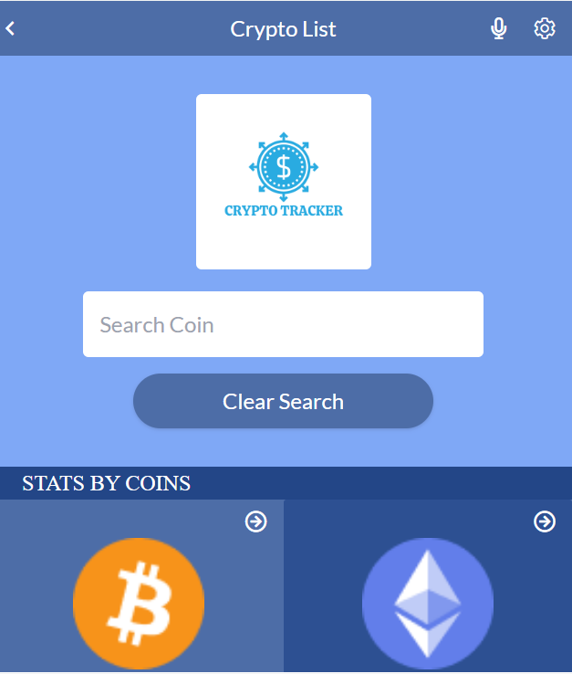
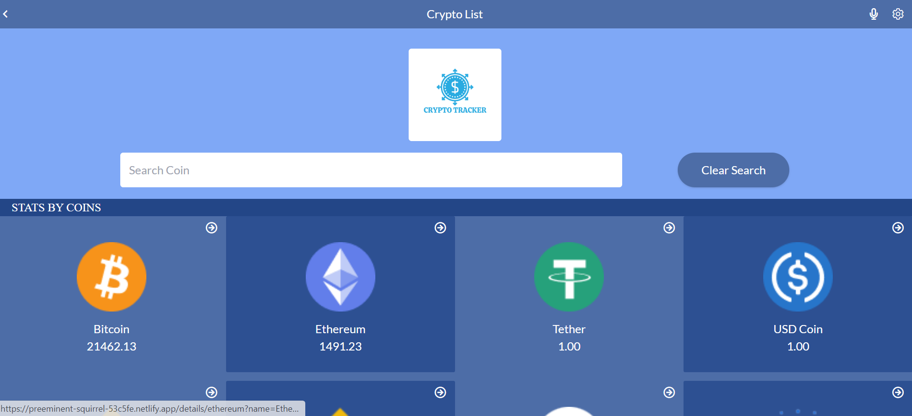
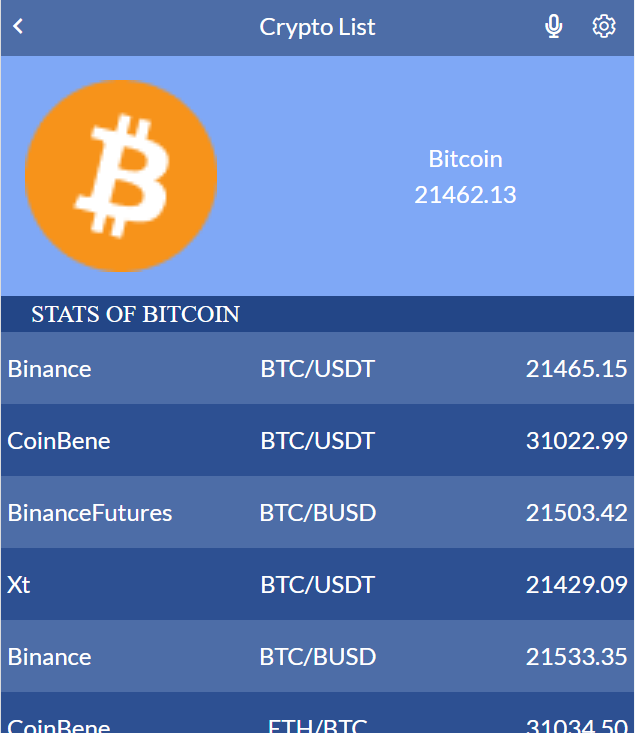
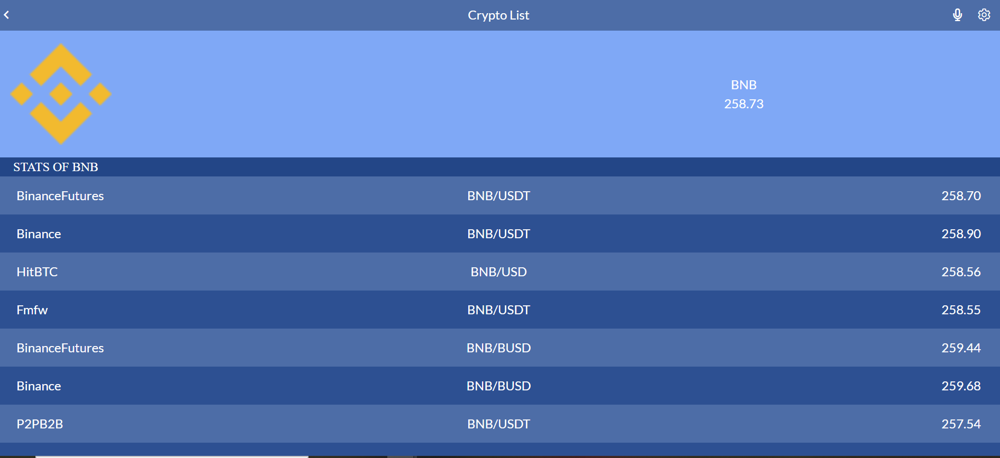

# CryptoTrackr

> This application tracks major cryptocurrencies in the market and displays their details, with a filter feature to view data for specific cryptocurrencies selected by the user.

## Built With

- React JS
- Redux
- API
- Tailwind CSS
- HTML5

## Live Demo (Click To View)

[Live Demo Link](https://crypto-tracker-rito.netlify.app/)

>
>
## Project view
 ### Home view 


### Detail view



## Built With

- 
- 
-  
-  
- 
- 
- 
- 


## Setup

To get this project up and running, you should do the following;
If you wish to run the project locally, please do the following:

1.- Clone the repository to your local machine.
    - **`git clone https://github.com/AnirudhRana55/CryptoTrackr.git`**
    - **`cd crypto-tracker`**

2.- Install Node.js and npm if you haven't already.
   To install Node.js, follow the instructions on [Node.js](https://nodejs.org/en/).
   
   To install npm with the necessary dependencies, run the following command in your terminal:
   ``` bash
   npm install 
   ```

3.- Once you have the setup and the project locally, you can run the project using the following command in your terminal:
``` bash
npm run build
```
4.- and if you want to watch the changes live, run the following command (it will run the website on localhost:3000):
``` bash
npm start
```
